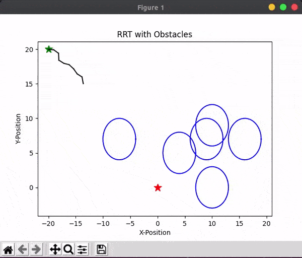
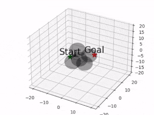
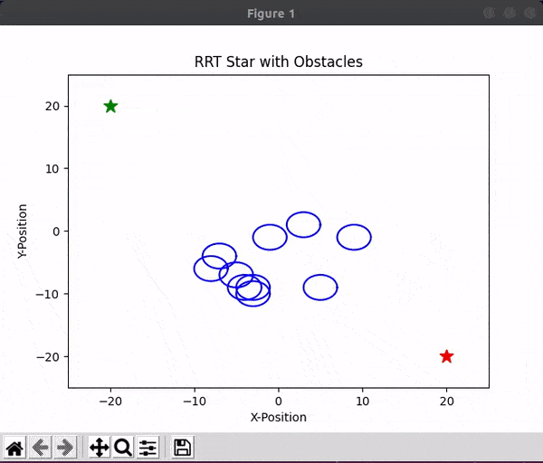
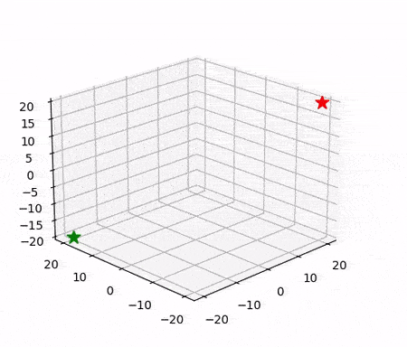

# rrt_planner_tutorial

This is the rrt, rrt* planner tutorial implemented after reading the **Sampling-based Algorithms for Optimal Motion Plannig** article.

### 1. Article Review

If you go to the page below, you can see the summary of the contents of the thesis.

<a href="https://jdj2261.github.io/review/2021/10/07/rrt-star-review.html" target="_blank">Sampling-based Algorithms for Optimal Motion Plannig review </a>

### 2. Directory Configuration

~~~bash
├── README.md
├── img
│   └── rrt-star.png
├── rrt
│   ├── 2d
│   │   ├── rrt.ipynb
│   │   ├── rrt.py
│   │   └── rrt_sim.py
│   └── 3d
│       ├── rrt_3d.ipynb
│       ├── rrt_3d.py
│       └── rrt_3d_sim.py
└── rrt_star
    ├── 2d
    │   ├── rrt_star.ipynb
    │   ├── rrt_star.py
    │   └── rrt_star_sim.py
    └── 3d
        ├── rrt_star_3d.ipynb
        ├── rrt_star_3d.py
        └── rrt_star_3d_sim.py
~~~

### 3. RRT, RRT* Compare Results

> red line 	: RRT
>
> green line : RRT*

### 4. Simulation Results

- RRT

|                          RRT 2D                           |                          RRT 3D                           |
| :-------------------------------------------------------: | :-------------------------------------------------------: |
|  |  |

- RRT-star

|                         RRT Star 2D                          |                         RRT Star 3D                          |
| :----------------------------------------------------------: | :----------------------------------------------------------: |
|  |  |

