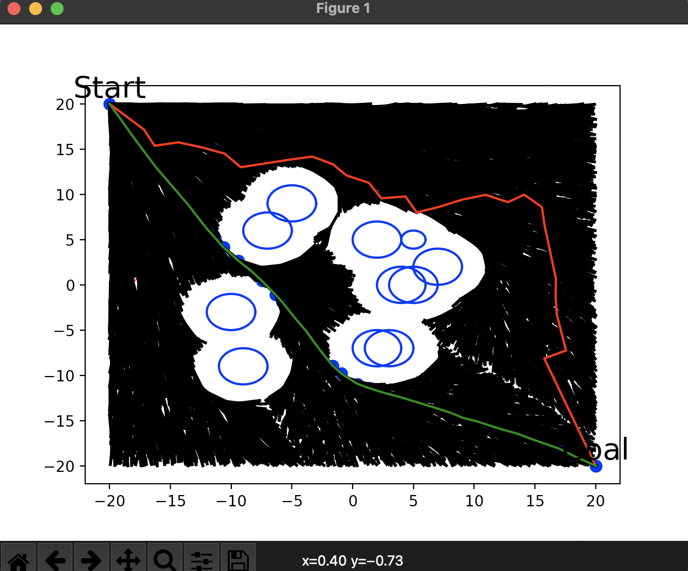

# rrt_planner_tutorial

This is the rrt, rrt* planner tutorial implemented after reading the **Sampling-based Algorithms for Optimal Motion Plannig** article.

### 1. Article Review

If you go to the page below, you can see the summary of the contents of the thesis.

<a href="https://jdj2261.github.io/review/2021/10/07/rrt-star-review.html" target="_blank">Sampling-based Algorithms for Optimal Motion Plannig review </a>

### 2. Directory Configuration

~~~bash
├── README.md
├── img
│   └── rrt-star.png
├── rrt
│   ├── rrt.ipynb
│   ├── rrt.py
│   ├── rrt_3d.ipynb
│   └── rrt_3d.py
└── rrt_star
    ├── rrt_star.ipynb
    ├── rrt_star.py
    ├── rrt_star_3d.ipynb
    └── rrt_star_3d.py
~~~

### 3. RRT, RRT* Compare results

> red line 	: RRT
>
> green line : RRT*

